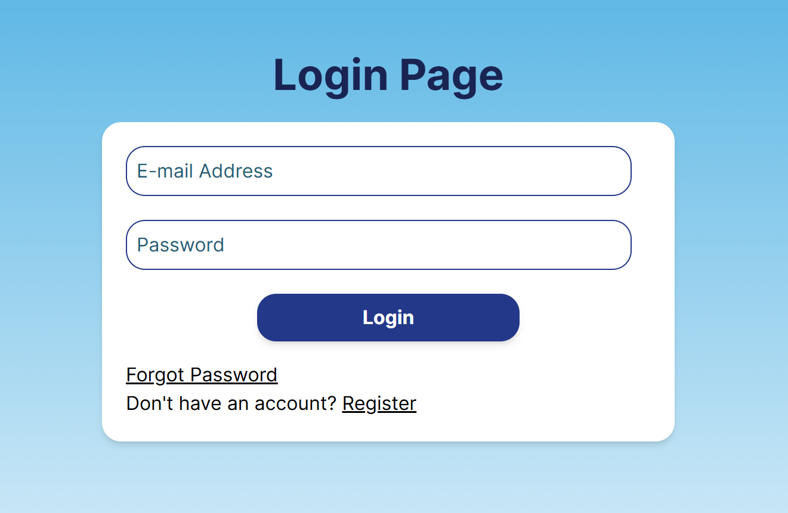
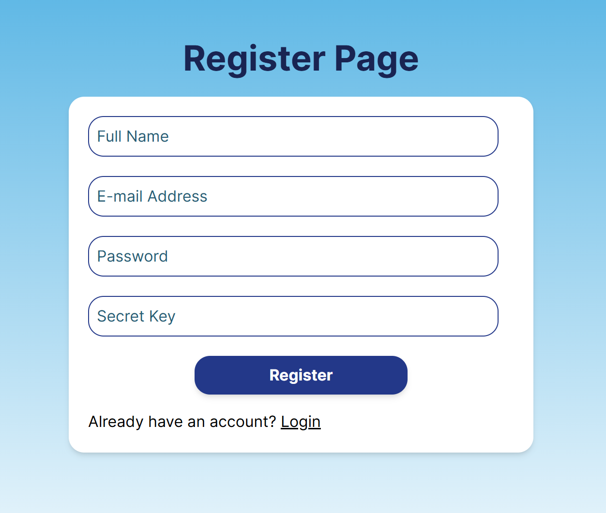
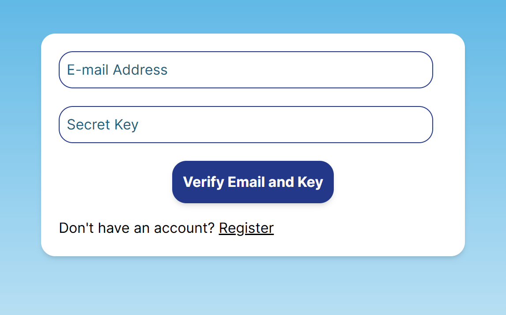
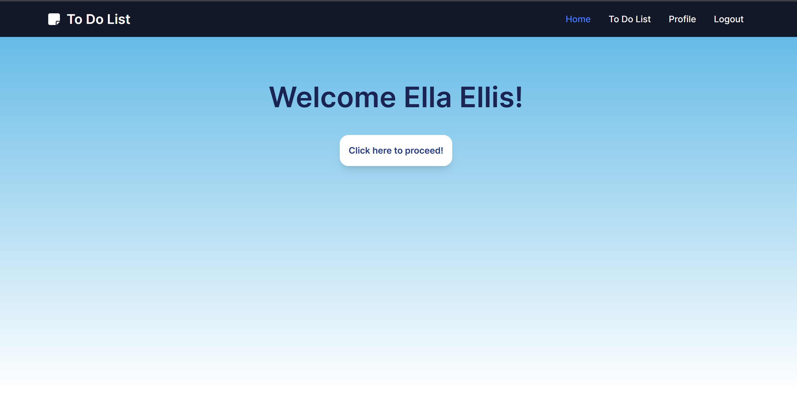
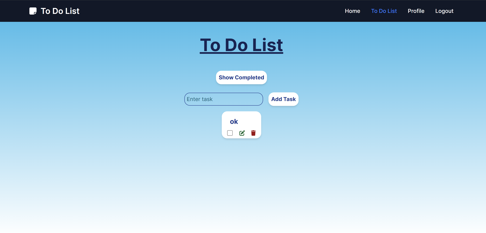
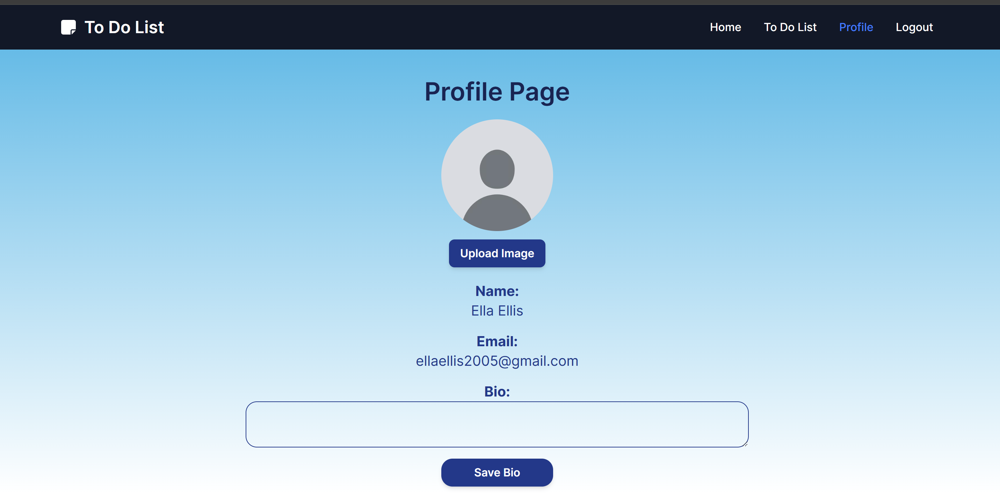
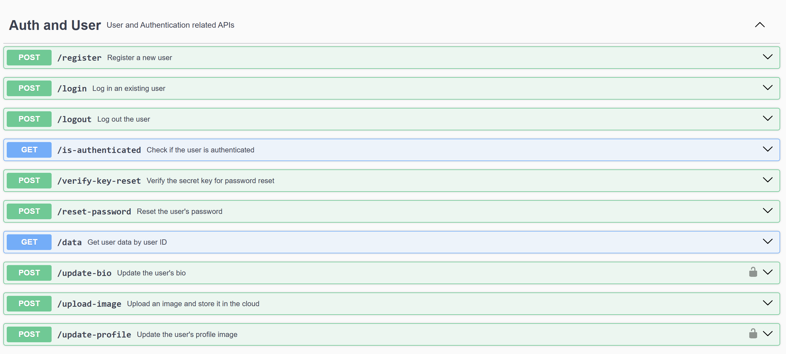
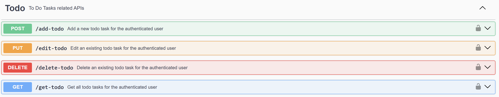

# WADS - To Do List TA

**Name:** Ellis Raputri

**Class:** L4AC

**Student ID:** 2702298116

<br>

## Project Description
This project is a simple To Do app containing a todo list that is connected to the local MySQL database. This project shows the implementation of REST API in NodeJS. In this app, each user can login with their email to access the app. User can also customize their profile picture and bio in this app.

<br>

## Setup Process

- Clone the repository and change directory to the respective repository.
    ```text
    git clone https://github.com/ellisraputri/WADS-ToDoList-RESTAPI
    cd WADS-ToDoList-RESTAPI
    ```

- Installing all dependencies in backend.
    ```text
    cd backend
    npm install
    ```

- Copy the backend.txt file and put it into a .env file in the backend folder. Remember to fill in each field accordingly.
  

- Run the backend
    ```text
    npm run dev
    ```

- Open a new terminal for the frontend and install all dependencies.
    ```text
    cd frontend
    npm install
    ```

- Run the frontend.
    ```text
    npm run dev
    ```

- Access the application at localhost:5173.

<br>


## GUI Screenshots
<details>
<summary>&ensp;<b>Login and Register Page</b></summary>

- User can log in through the login page and register through the register page.

- If users forgot their password, they can also link to the forgot password page to resend an email to reconfigure their password.

    <br><br>

    <br><br>

    <br>

<br>
</details>

<details>
<summary>&ensp;<b>Home Page</b></summary>

- Landing page for the user to proceed to the To Do app.

  <br>

<br>
</details>

<details>
<summary>&ensp;<b>To Do Page</b></summary>

- Contains a simple to do app where users can add, update, or delete their tasks.

  <br>

<br>
</details>

<details>
<summary>&ensp;<b>Profile Page</b></summary>

- In this page, users can update their profile picture and bio.

  <br>

<br>
</details>


<br>


## API Documentation
To access the API documentation, run the backend server and access http://localhost:5000/api-docs/.

<br>

<br>
